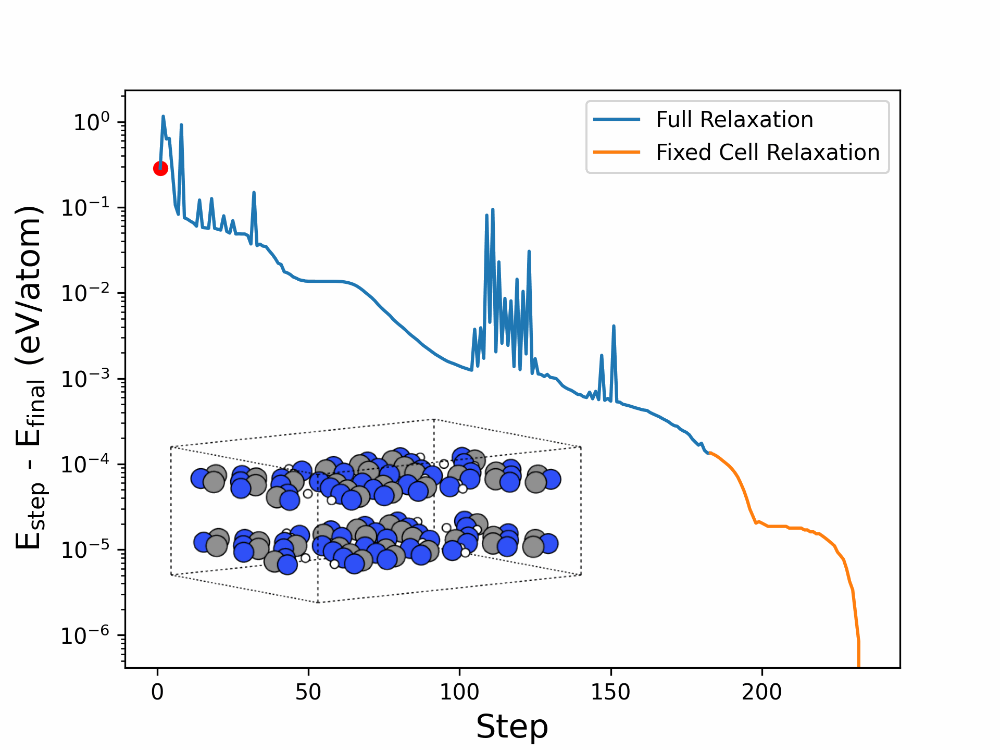

# ML_Symmetry_Analysis_for_Material

This is a repository to showcase the analysis of material structures in CIF format. There are four components to the repository:

- parser.py is a python code used to parse CIF files and extract the important material information (lattice parameters, atomic positions, symmetries, etc.)
- Symmetry.ipynb is a Jupyter notebook used to perform a check on the symmetry operations provided in CIFs.
- M3GNet_Relaxation.ipynb is a Jupyter notebook in which a message-passing graph neural network is used to relax crystal structures.
- Cluster_M3GNet.ipynb is a Jupyter notebook in which the graph neural network features are used to perform clustering and dimesnionality reduction.

The directory CIF stores the different structures provided in CIF format, while the Relaxations directory provides the results of the M3GNet-driven relaxations.

## CIF Parser

The CIF parser (python object CIFParser), is used to read CIFs line by line and store the relevant information. The notable attributes and methods are:

Attributes

- lattice_parameters: list, with the six lattice parameters (a, b, c, alpha, beta, gamma).
- sg_cif: int, the IT space group number of the cell as given by the CIF.
- unique_positions: dict, with the different constituent elements as keys and the positions of atoms as an ndarray as values.
- symmetry_operations: list, the different symmetry operations, as given by the CIF symmetry block, wirtten as strings in xyz format.
- sg_full_cif: str, name of the full space group.

Methods

- apply_symmetry_operator(symm_op, position): applies a symmetry operation to a position to generate a new poistion.
- apply_symmetries(): goes through all positions and applies all symmetries to them, returns only the unique positions.
- match_sapce_groups(): built on pyxtal, creates a general Wyckoff position from the CIF space group (sg_cif) and from the CIF symmetry operations and compares them. If it does not match, the full space groups are further compared.

## Symmetry Check

All CIFs are read in using the parser and the match_space_group() method is called to check ocmpatibility of the symmetries. For the 18 structures, three different cases arise:

1. The symmetries match (13/18)
2. The symmetries do not match, but the full space groups do match (2/18)
3. The symmetries cannot be read in as Wyckoff positions, as they do not match any of the recognised symmetry operations for any Wyckoff position (3/18).

### Here is an example of case 2:

file: <b>group-14-4_CollCode22693.cif</b>

Space Group: <b>14</b> 

Conventional full Space Group name: <b>P 1 21/c 1</b>

CIF Space Group name: <b>P 1 21/n 1</b>

Symmetry of Space Group 14:

- x, y ,z
- -x, y + 1/2, -z + 1/2
- -x, -y, -z
- x, -y + 1/2, z + 1/2

Symmetry of CIF:

- -x+1/2, y+1/2, -z+1/2
- -x, -y, -z
- x+1/2, -y+1/2, z+1/2
- x, y, z

The difference is due to the difference in cell definition convention, as reflected by the different full space group name. When the symmetries are read in, it leads to the correct full Space Group symbol.

### Here is an example of case 3:

file: <b>group-18_CollCode60570.cif</b>

Space Group: <b>18</b> 

Conventional full Space Group name: <b>P 21 21 2</b>

CIF Space Group name: <b>P 21 2 21</b>

Symmetry of Space Group 14:

- -x + 1/2, -y + 1/2, -z
- x + 1/2, -y + 1/2, -z
- -x, -y, z
- x, y, z

Symmetry of CIF:

- -x + 1/2, -y, z + 1/2
- x + 1/2, -y, -z + 1/2
- -x, y, -z
- x, y, z

Here again the full space group names do no match. However, the IT do not have several different cell choices, thus for Space Group 18 only one set of symmetries exist. It would appear that here, y- and z-axis are swapped compared to convention. 

## M3GNet Relaxations

M3GNet is a crystal graph neural network, a message-passing graph neural netowrk, which includes 3-body interactions. A material is represented by a graph, with the atoms sitting at the graph nodes and the edges representing bonds
between "neighbouring" atoms (within a cutoff radius). It is trained on data from the Materials Project and can act as a universal interatomic potential, capable of performing relaxation for materials of virtually any composition. 

The reference paper is:

> **M3GNet**
>
> Chen, C., Ong, S.P. _A universal graph deep learning interatomic potential for the periodic table._ Nature
> Computational Science, 2023, 2, 718–728. DOI: 10.1038/s43588-022-00349-3

The Github repository of the MatGL library (that uses the deep graph library to represent graphs and pytorch) is:

https://github.com/materialsvirtuallab/matgl/tree/main

In the notebook, following some manual pre-processing (removal of partial occupancies), the structures are read in using the parser and converted to pymatgen Structure objects. These can directly be relaxed by the M3GNet potential. 
The relaxation process is carried out in two steps:

1. A full relaxation with a low convergence crterion, using LBFGS.
2. A fixed cell relaxation with a higher convergence criterion, using FIRE.

All compounds are successfully relaxed. The relaxation path structures are saved, as well as the plot of the energy change during the relaxation. An example is shown below.

## Clustering and Dimensionality Reduction

Finally, the last notebook uses the edge and node features of the graphs of each structure as feature representations. Note that there are many vectors per structure, and in fact more with increasing system size.
KMeans clustering with three clusters is performed on these vectors,in order to see if there is any clustering by space group. This is performed for the edge and node features separately. The results are shown below, following PCA:

As can be seen, there are not three obvious clusters and there is no space-group dependent cluster. For the node features, it is interesting to look at the PCA again but with atomic symbols as labels:

